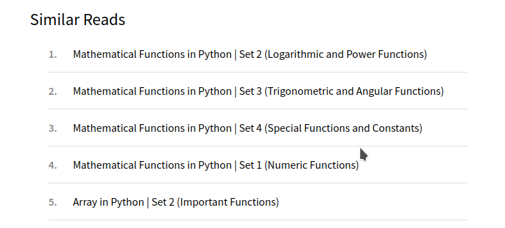

# NexaScale 30-Days-of-Data-Structures-and-Algorithm

### Day 1: What is Data Structure
[What is Data Structure: Types, Classifications and Applications](https://www.geeksforgeeks.org/what-is-data-structure-types-classifications-and-applications/)

**Additional Resources (optional)**
- [Beginner Data Structures Explained Like You Are 5](https://youtu.be/o6VuST08S60)

### Day 2: Introduction to Data Structures
- [Introduction to Data Structures](https://www.geeksforgeeks.org/introduction-to-data-structures/)
- [Common operations on various Data Structures](https://www.geeksforgeeks.org/common-operations-on-various-data-structures/)

**Additional Resources (optional)**
- [Data Structures & Algorithms #1 - What Are Data Structures?](https://youtu.be/bum_19loj9A)

### Day 3: What is Array?
- [What is an Array?](https://www.geeksforgeeks.org/what-is-array/)
- [Introduction to Arrays – Data Structure and Algorithm Tutorials](https://www.geeksforgeeks.org/introduction-to-arrays-data-structure-and-algorithm-tutorials/)
- [Applications, Advantages and Disadvantages of Array](https://www.geeksforgeeks.org/applications-advantages-and-disadvantages-of-array-data-structure/)

**Additional Resources (optional)**
- [An Overview of Arrays and Memory](https://youtu.be/pmN9ExDf3yQ)
- [Array in Data Structure](https://youtu.be/b8cPdOX-ID4)

### Day 4: Introduction of Array in Different language

Select one of the following that matches your language of choice
- [Arrays in C/C++](https://www.geeksforgeeks.org/c-arrays/)
- [Arrays in Java](https://www.geeksforgeeks.org/arrays-in-java/)
- [Arrays in Python](https://www.geeksforgeeks.org/array-python-set-1-introduction-functions/)
- 
- [Arrays in C#](https://www.geeksforgeeks.org/c-sharp-arrays/)
- [Arrays in JavaScript](https://www.geeksforgeeks.org/arrays-in-javascript/)

**Addiional Resources (optional)**
- (Arrays in Python)[https://youtu.be/21dgNSzG2Iw]
- (Arrays in Javascript)[https://youtu.be/txjmvEPlAtU]
- (Arrays in C/C++)[https://youtu.be/TzB5ZeKQIHM]
- (C# Working with Arrays)[https://youtu.be/2U3jZLpFYyE]

## Basic Operations of Array - Searching Algorithm
### Day 5: Linear Search Algorithm
- (Linear Search)[https://www.geeksforgeeks.org/linear-search/]
- (Sentinel Linear Search)[https://www.geeksforgeeks.org/sentinel-linear-search/]

**Additional Resources (optional)**
- (Linear Search in 3 minutes)[https://www.youtube.com/watch?v=246V51AWwZM]
- (Linear Search Simplilearn)[https://www.youtube.com/watch?v=ijK6yqDGQUg]
- (Linear Search Animated)[https://youtu.be/yRErgiYyv_E]

### Day 6: Binary Search Algorithm
- (Binary Search – Data Structure and Algorithm Tutorials)[https://www.geeksforgeeks.org/binary-search/]
- (Meta Binary Search - One sided Binary search)[https://www.geeksforgeeks.org/meta-binary-search-one-sided-binary-search/]

**Additional Resources (optional)**
- (Introduction to Binary Search)[https://www.youtube.com/watch?v=6ysjqCUv3K4]
- (Binary Search Explained)[https://youtu.be/ttiofs3n_hA]
- (Binary Search Animated)[https://youtu.be/DRsJ8sA9xzc]

### Day 7: Ternary Search and Jump Search
 - (Ternary Search)[https://www.geeksforgeeks.org/ternary-search/]
 - (Jump Search)[https://www.geeksforgeeks.org/jump-search/]

### Day 8: Interpolation Search and Exponential Search
- (Interpolation Search)[https://www.geeksforgeeks.org/interpolation-search/]
- (Exponential Search)[https://www.geeksforgeeks.org/exponential-search/]

### Day 9: Fibonacci Search and Ubiquitous
- (Fibonacci Search)[https://www.geeksforgeeks.org/fibonacci-search/]
- (Ubiquitous Binary Search)[https://www.geeksforgeeks.org/the-ubiquitous-binary-search-set-1/]

## Comparisons

### Day 10: Linear Search Vs Binary Search
- (Linear Search vs Binary Search)[https://www.geeksforgeeks.org/linear-search-vs-binary-search/]

**Additional Resources (optional Resources)**
- (Linear vs Binary search GeeksForGeeks)[https://www.youtube.com/watch?v=qBGLYzFF1aQ]
- (Linear Search Vs Binary search Animated)[https://youtu.be/FHRyqWdLkpE]

### Day 11: Interpolation Search Vs Binary Search
- (Interpolation Search vs Binary Search)[https://www.geeksforgeeks.org/g-fact-84/]
- (Why is Binary Search preferred over Ternary Search?)[https://www.geeksforgeeks.org/binary-search-preferred-ternary-search/]

**Additional Resources (optional)**
- (Interpolation Search)[https://youtu.be/YSVS5GG1JuI]
- (Ternary Search Vs Binary Search)[https://youtu.be/8AE8aZ7kEkk]

### Day 12: Introduction to Linked List
- (What is Linked List)[https://www.geeksforgeeks.org/what-is-linked-list//]

**Additional Resources (optional)**
- (Linked List in Data Structure)[https://youtu.be/WwfhLC16bis]

### Day 13: Introduction to Linked List (cont...)
- (Linked List – Data Structure and Algorithm )[https://www.geeksforgeeks.org/introduction-to-linked-list-data-structure-and-algorithm-tutorial/]

**Additional Resources (optional)**
- (Introduction to Linked List)[https://youtu.be/R9PTBwOzceo]

### Day 14: Application of Linked List
- (Applications, Advantages and Disadvantages of Linked List)[https://www.geeksforgeeks.org/applications-advantages-and-disadvantages-of-linked-list/]

### Day 15: Linked List Vs Array
- (Linked List vs Array)[https://www.geeksforgeeks.org/linked-list-vs-array/]

**Additional Resources (Optional)**
- (Array vs Linked List - JOMA)[https://youtu.be/ir2gbu3Lj8s]
- (Linked List vs Array - Neso Academy)[https://youtu.be/b5QR4AmrspU]
- (Linked List vs Array - Simplilearn)[https://youtu.be/Muo0UdwESn4]

### Day 16: Doubly Linked List
- [Introdcuction to Doubly Linked List](https://www.geeksforgeeks.org/data-structures/linked-list/doubly-linked-list/)
- [Doubly Linked List meaning in DSA](https://www.geeksforgeeks.org/doubly-linked-list-meaning-in-dsa/)

**Additional Resources**
- [Doubly Linked List: Naso Academy](https://youtu.be/e9NG_a6Z0mg)
- [Doubly Linked List in DSA](https://youtu.be/3RzC2NrCO24)

### Day 17: Memory Efficient Doubly Linked List
- [Memory Efficient Doubly Linked List](https://www.geeksforgeeks.org/memory-efficient-doubly-linked-list/)

### Day 18: Doubly Linked List Basic Operations
- [Introduction and Inserttion in a Doubly Linked List](https://www.geeksforgeeks.org/introduction-and-insertion-in-a-doubly-linked-list/)
- [Reverse Doubly Linked List](https://www.geeksforgeeks.org/reverse-a-doubly-linked-list/)
- [Delete Node in Doubly Linked List](https://www.geeksforgeeks.org/delete-a-node-in-a-doubly-linked-list/)

**Additional Resources**
- [Learn Linked List in 13mins - Bro Code](https://youtu.be/N6dOwBde7-M)

### Day 19: Types of Linked Lists
- [Types of Linked List](https://www.geeksforgeeks.org/types-of-linked-list/)

**Additional Resources**
- [Types of Linked List with Real world Examples](https://www.youtube.com/watch?v=jnVrh_JMzag)

### Day 20: Basic Linked Lists Operations
- [Basic Operations - Insertion in Linked List](https://www.geeksforgeeks.org/insertion-in-linked-list/)

### Day 21: Basic Linked Lists Operations Part 2
- [Search an Element in Linked List](https://www.geeksforgeeks.org/search-an-element-in-a-linked-list-iterative-and-recursive/)

### Day 22: Stack Data Structure
- [Introduction to Stack](https://www.geeksforgeeks.org/introduction-to-stack-data-structure-and-algorithm-tutorials/)
- [Application, Advantages and Disadvantages](https://www.geeksforgeeks.org/applications-advantages-and-disadvantages-of-stack/)

### Day 23: Stack Data STructure Part 2
- [Implement a Stack Using Singly Linked List](https://www.geeksforgeeks.org/implement-a-stack-using-singly-linked-list/)
- 

### Day 24: Implementation of Stack in Different Languages
- [Stack in C++](https://www.geeksforgeeks.org/stack-in-cpp-stl/)
- [Stack in Java](https://www.geeksforgeeks.org/stack-class-in-java/)
- [Stack in Python](https://www.geeksforgeeks.org/stack-in-python/)
- [Stack in C#](https://www.geeksforgeeks.org/c-sharp-stack-with-examples/)
- [Stack Implementation in JavaScript](https://www.geeksforgeeks.org/implementation-stack-javascript/)

### Day 25: Queue Data Structure
- [Introduction to Queue DS&A](https://www.geeksforgeeks.org/introduction-to-queue-data-structure-and-algorithm-tutorials/)
- [Implementation of Queue using Array](https://www.geeksforgeeks.org/introduction-and-array-implementation-of-queue/)
- [Queue - Linked List Implementation](https://www.geeksforgeeks.org/queue-linked-list-implementation/)

### Day 26: Queue Implementation in Various Programming Language
- [Queue in C++](https://www.geeksforgeeks.org/queue-cpp-stl/)
- [Queue Interface in Java](https://www.geeksforgeeks.org/queue-interface-java/)
- [Queue Implementation in Python](https://www.geeksforgeeks.org/queue-in-python/)
- [Queue in C#](https://www.geeksforgeeks.org/c-sharp-queue-with-examples/)
- [Queue Implementation in JavaScript](https://www.geeksforgeeks.org/implementation-queue-javascript/)

### Day 27: Binary Tree Data Structure
- [Overview](https://www.geeksforgeeks.org/binary-tree-data-structure/#Introduction)
- [Introduction to Binary Tree](https://www.geeksforgeeks.org/introduction-to-binary-tree-data-structure-and-algorithm-tutorials/)
- [Properties of Binary Tree](https://www.geeksforgeeks.org/properties-of-binary-tree/)
- [Types of Binary Tree](https://www.geeksforgeeks.org/types-of-binary-tree/)

### Day 28: Binary Tree Part 2
- [Application - Adnavtages - Disadvantages of Binary Tree](https://www.geeksforgeeks.org/applications-advantages-and-disadvantages-of-binary-tree/)
- [Binary Tree Array Implementaion](https://www.geeksforgeeks.org/binary-tree-array-implementation/)
- [Complete Binary Tree](https://www.geeksforgeeks.org/complete-binary-tree/)
- [Perfect Binary Tree](https://www.geeksforgeeks.org/perfect-binary-tree/)

### Day 29: Basic operation of Binary Tree
- [Tree Traversal Technique](https://www.geeksforgeeks.org/tree-traversals-inorder-preorder-and-postorder/)
- [Level Order Tree Traversal](https://www.geeksforgeeks.org/level-order-tree-traversal/)
- [Insertion in a binary Tree](https://www.geeksforgeeks.org/insertion-in-a-binary-tree-in-level-order/)

### Day 30: Basic Operation of Binary Tree Part 2
- [Deletion in binary](https://www.geeksforgeeks.org/deletion-binary-tree/)
- [Enumeration of Binary Tree](https://www.geeksforgeeks.org/enumeration-of-binary-trees/)

## THE END!!!

_Side note: This once a week meeting for DSA is not enough, I'm thinking of doing a video of the present day learning challenge and share so that members of the community can watch and learn, then they will be a form where they can send their answers to. I can do a quick technical article on the answers or video or discuss it in our office hours._
